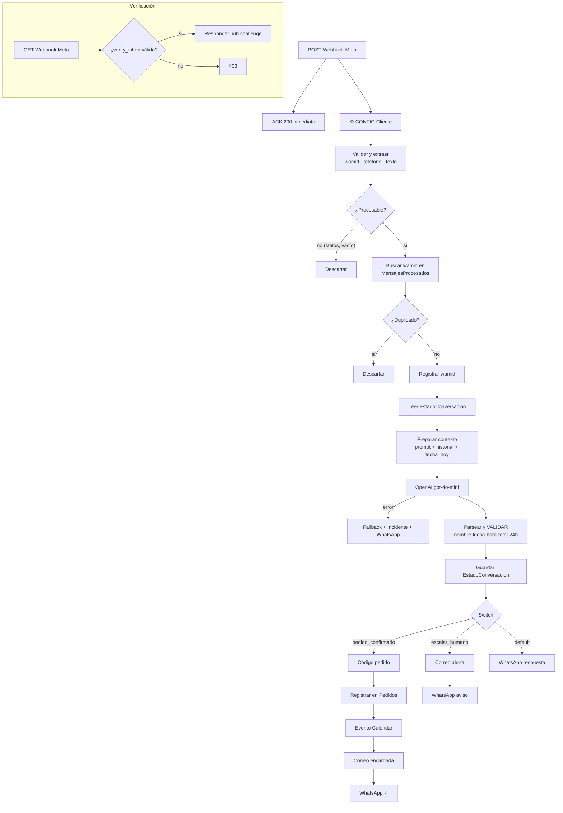

# Flujo de trabajo — Bot WhatsApp La Pastelería

## Cómo funciona (visión general)

El bot es un ciclo de 6 pasos que se repite con cada mensaje del cliente:

1. **Meta entrega el mensaje** de WhatsApp a un webhook de n8n (POST). n8n responde 200 de inmediato para que Meta no reintente.
2. **Se valida y filtra**: solo mensajes de texto reales pasan (los acuses "entregado/leído", audios e imágenes se manejan aparte). El teléfono se normaliza (solo dígitos) y se revisa el `wamid` (ID único del mensaje) contra la hoja `MensajesProcesados`: si ya se procesó, se descarta (evita duplicados por reintentos de Meta).
3. **Se recupera la memoria**: la hoja `EstadoConversacion` guarda por teléfono el historial, el estado (INICIO, ARMANDO_PEDIDO, CONFIRMACION...), el pedido en curso y los datos del cliente.
4. **La IA responde**: se envía a OpenAI el prompt del negocio (carta, horarios, reglas) + historial + contexto (incluye fecha y hora actual de Chile). El modelo devuelve un JSON con la respuesta, el nuevo estado, el pedido y flags.
5. **El código revalida** lo que dijo el modelo: recalcula el total, y solo acepta `pedido_confirmado` si hay nombre + fecha + hora válidos, en horario (09:00–21:30), en el futuro, y con 24 h de anticipación para tortas de encargo. Si algo falta, la confirmación se bloquea y se le pide el dato al cliente.
6. **Se actúa según la rama**:
   - **Pedido confirmado** → genera código único (`LP-AAAAMMDD-XXXXXX`) → registra en hoja `Pedidos` → crea evento en Calendar (fecha real, zona America/Santiago) → correo a la encargada → confirma al cliente por WhatsApp.
   - **Escalar a humano** (alergias, cliente molesto) → correo de alerta → aviso al cliente.
   - **Conversación normal** → respuesta por WhatsApp.
   - **Error de OpenAI** → respuesta segura al cliente + fila en hoja `Incidentes`.

Además existe un webhook GET separado que responde el *challenge* de verificación de Meta, ahora validando el `verify_token`.

## Diagrama (v2)

## Qué cambió respecto a la v1

| Problema v1 | Solución v2 |
|---|---|
| Leía `$json.entry` (datos llegaban vacíos) | Lee `$json.body.entry`, validado |
| Switch sin rama de pedido confirmado; pedidos no se registraban | Rama 1 del Switch = `pedido_confirmado === true`, decidido por código tras validaciones |
| Evento Calendar siempre "hoy", sin zona horaria | Fecha real del retiro + offset America/Santiago calculado por fecha (horario de verano incluido) |
| Sin control de duplicados | Dedup por `wamid` en hoja `MensajesProcesados`; código de pedido reproducible |
| Verificación GET respondía a cualquiera | Valida `hub.mode` y `hub.verify_token` |
| Payloads de estado y multimedia rompían el flujo | Filtro al inicio; multimedia recibe respuesta pidiendo texto |
| Teléfono con formatos mixtos | Normalización única: solo dígitos con código de país |
| Respuestas con comillas rompían el JSON del envío (rama default) | `JSON.stringify` en todos los envíos |
| Sin manejo de errores | Reintentos + rama de error de OpenAI + `onError: continue` en Sheets/Calendar/Gmail + hoja `Incidentes` |
| Total y confirmación decididos por el modelo | Total recalculado y confirmación revalidada en código |
| Nombres Twilio/Claude falsos, credenciales sobrantes | Nombres reales (Meta/OpenAI), credenciales mínimas |
| IDs y correos hardcodeados | Nodo `⚙️ CONFIG · Cliente` con placeholders (base de la plantilla multi-cliente) |
| Solo `hora_retiro` | `fecha_retiro` + `hora_retiro` en prompt, estado, pedidos y Calendar |
| Graph API v17.0 | v21.0 configurable en CONFIG |

## Hojas de Google Sheets requeridas (v2)

| Hoja | Columnas |
|---|---|
| `EstadoConversacion` | telefono, estado_conversacion, historial, pedido_actual, nombre_cliente, fecha_retiro, hora_retiro, ultima_actualizacion |
| `Pedidos` | codigo_pedido, timestamp, telefono, nombre_cliente, fecha_retiro, hora_retiro, productos, total, estado, nota_interna, calendar_event_id |
| `MensajesProcesados` | wamid, telefono, fecha |
| `Incidentes` | fecha, workflow, nodo, tipo_error, mensaje, telefono, resuelto |
